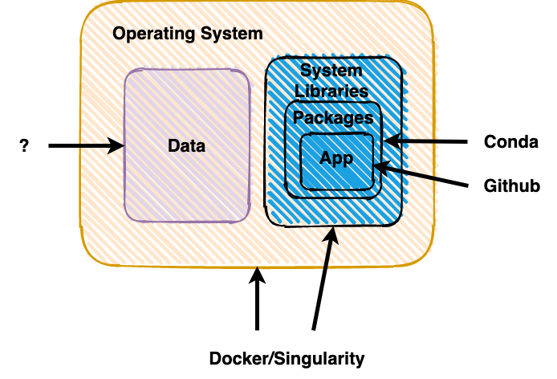
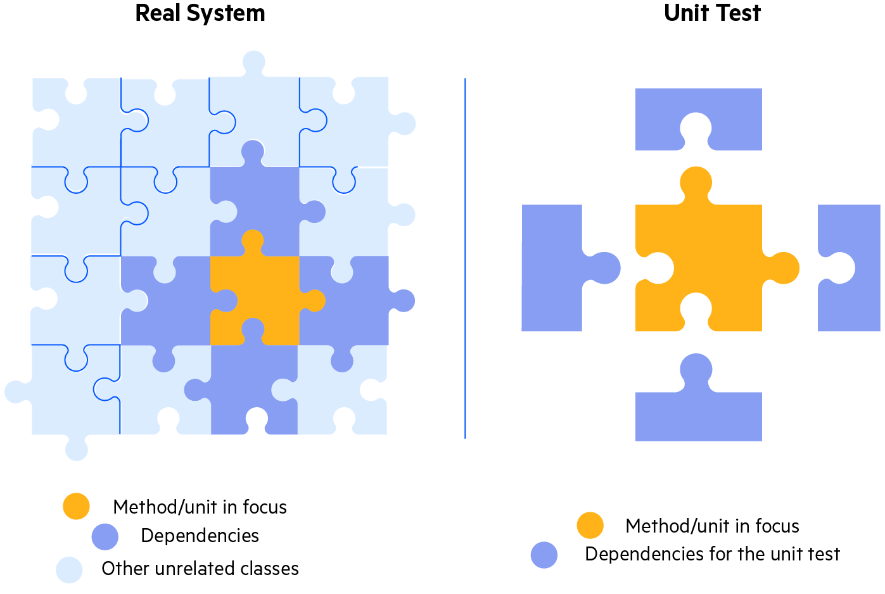

# Data Workflows

## Scaling Queries

```{warning}
With small or medium-sized datasets, we can mostly ignore issues like what format the data are in, or how to make queries more efficient. With bigger datasets, it is sometimes necessary to give these issues more thought.
```

```{note}
:class: tip
In general a good workflow is to take a sample of data, small enough to load into memory and manipulate easily using your programming language of choice. SQL is not a great language for prototyping and exploration. Use Python, R, or Stata instead. Scale your queries once you've figured out what you really need.
```


* Data format becomes important when scaling queries to large datasets comes into focus.
* Most of the datasets on the Kellog Data Cloud are stored in S3 buckets in compressed parquet format. This is a column-based storage layout that has become very popular for [OLAP-based](https://en.wikipedia.org/wiki/Online_analytical_processing) workloads. It's a good match for most of the kinds of things that Kellogg researchers do.
* Scaling tips: Leverage partitions where possible; use a subset of columns where possible; filter data in multiple steps where possible.
* Frameworks like [Apache Spark](https://docs.aws.amazon.com/athena/latest/ug/notebooks-spark.html) can be used for big (petabyte-scale) data workflows, or for workflows were you want to apply custom functions to big data.

```{admonition} More about format
Here is a high-level overview of different data layouts from an informative [blog post](https://towardsdatascience.com/demystifying-the-parquet-file-format-13adb0206705):


```

## Automating Workflows

* We can roughly divide data workflow development into two phases:
  * Exploration
  * Deployment
* Each phase benefits from different tools. For exploration, it pays to have a [REPL(https://en.wikipedia.org/wiki/Read%E2%80%93eval%E2%80%93print_loop) environment. [Jupyter notebooks](https://jupyter.org/) are particularly nice, but not required.
* Deployment benefits from tools that lend themselves to automation. Scripts (bash, python, R, or whatever else) that can be executed without any human interaction are the prototype.
* Automation goes hand in hand with version control and automated testing. Version control allows you to recover snapshots in time, and never worry that you've lost work. Tests give you increased confidence (though no guarantee) in the veracity of your analyses.
* The workshop repository contains a [sample project](https://github.com/rs-kellogg/data-the-right-way/tree/main/comscore-project) to demonstrate these concepts.

```{admonition} Reproducibility and Open Science
Automation, version control, and testing work together to help make your data workflows reproducible and resilient. This is a key component of [Open Science](https://www.cos.io/). Your future self will be grateful to you for doing it the right way!
```






