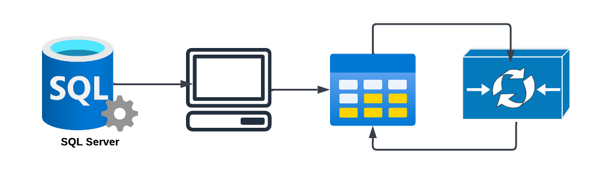
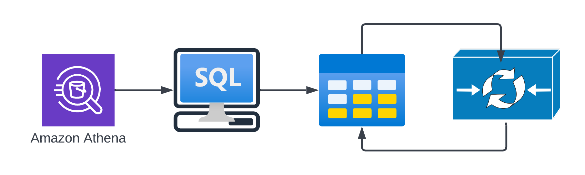
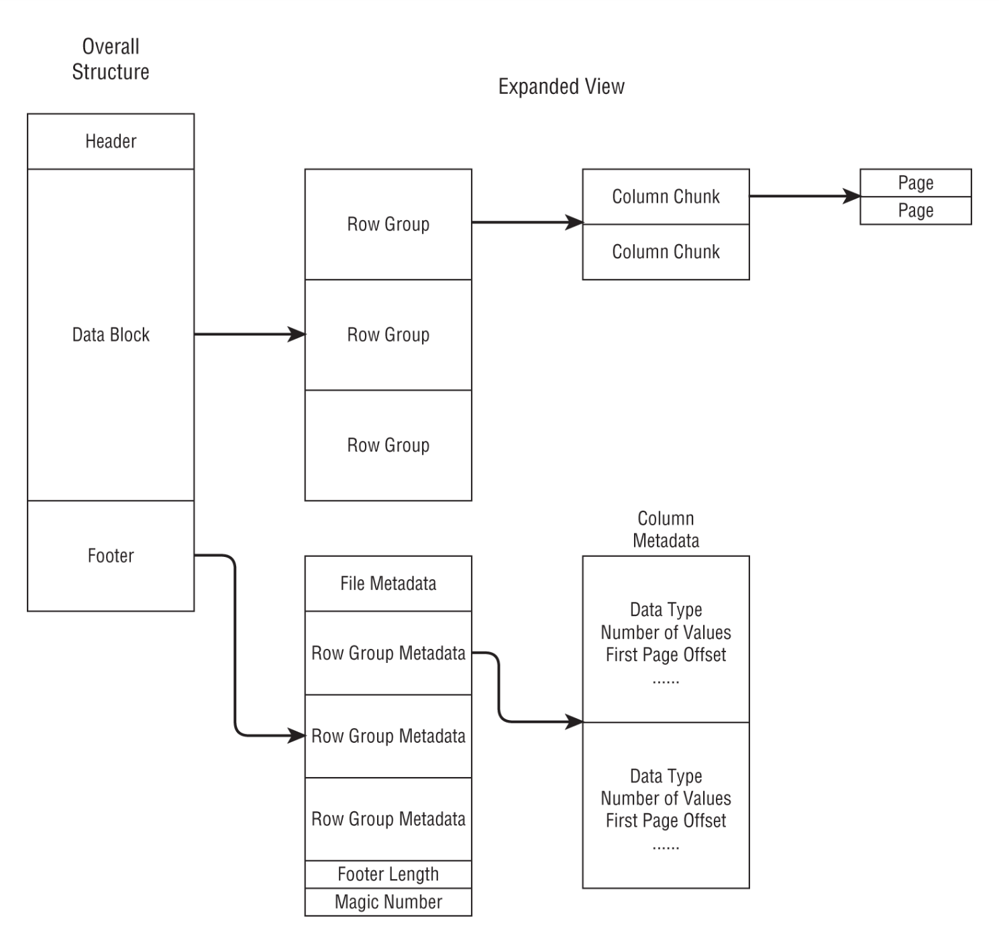

# KDC Datasets

* "KDC" is an ambiguous acronym. It can refer to the Kellogg Data Center (KDC) or the Kellogg Data Cloud (KDC). We will use the term "KDC" to refer to the Kellogg Data Cloud (KDC) and "KDC2" to refer to the Kellogg Data Center (KDC).
*  ([KDC02](https://www.kellogg.northwestern.edu/research-support/computing/kellogg-data-center.aspx)) is a Microsoft SQL Server is a relational database management system that is currently available to Kellogg faculty and students.
* KDC02 is nearing the end of it's life and is being replaced by a cloud-based solution ("KDC").
* However, there are many similarities in how data will be accessed, including the ability to use SQL clients and ODBC-based connections from software like R, Python, and Stata.

