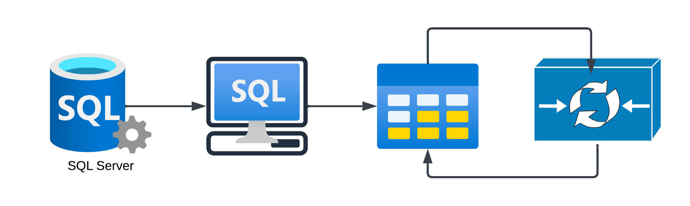
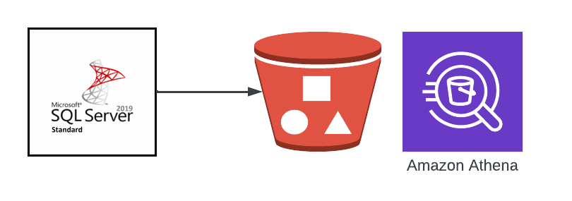

# KDC Datasets

*  The [Kellogg Data Center](https://www.kellogg.northwestern.edu/research-support/computing/kellogg-data-center.aspx) is a Microsoft SQL Server relational database management system that is currently available to Kellogg faculty and students.


- KDC is accessible from a *SQL* client
- This could be a dedicated SQL client, such as [Datagrip](https://www.jetbrains.com/datagrip/) or [MS SSMS](https://learn.microsoft.com/en-us/sql/ssms/download-sql-server-management-studio-ssms?view=sql-server-ver16) or many, many other choices
- It could also be a programmatic connection via [ODBC](https://en.wikipedia.org/wiki/Open_Database_Connectivity)
```{image} ./images/kdc-ssms-snapshot.png
    :alt: data-formats
    :width: 700px
    :align: center
```

```{warning}
KDC (Kellogg Data Center) will be retired this Summer. At that time, the acronym "KDC" will take on a new meaning, and will refer to the The <span style="color:purple">*Kellogg Data Cloud*</span>.


```

```{admonition} Benefits of moving to the cloud
Moving data to the cloud unlocks a huge toolset for data processing, including handling of very large scale datasets, image processing, text processing, and GPUs for deep learning.


```

*  The [Kellogg Data Cloud](https://nu-sso.awsapps.com/start/#/) is a cloud-based data storage and compute environment. Currently we are focused on using Amazon Web Services (AWS) for storage and compute, though we may expand to other cloud providers in the future. We will focus on using [AWS Athena](https://docs.aws.amazon.com/athena/latest/ug/what-is.html) for querying data in the Kellogg Data Cloud.


```{admonition} How does this change things?
:class: tip
Accessing data will be similar, but the underlying infrastructure will be different. The Kellogg Data Cloud is a cloud-based data storage and compute environment. The cloud environment will offer many advantages in scalability, computating resources, and cost.
```

* There are many similarities between these two systems, including the ability to use SQL clients and ODBC-based connections from software like R, Python, and Stata. The cloud-based version has the advantage of being able to handle larger datasets, and allowing us to take advantage of the many tools available in the cloud.
* [ODBC example notebook](https://github.com/rs-kellogg/data-the-right-way/blob/main/pyodbc-example.ipynb)

[Athena documentation](https://docs.aws.amazon.com/athena/latest/ug/what-is.html){:target="_blank"}


```{note}
Athena carries out queries simultaneously, so even queries on very large datasets can be obtained within seconds. Due to Athena’s distributed, serverless architecture, it can support large numbers of users and queries, and computing resources like CPU and RAM are seamlessly provisioned.
```

* Example: AWS web-based query console removes need to install and connect through a 3rd party tool
* Example: firing up an EC2 instance with GPUs for machine learning [AWS Deep Learning AMIs](https://aws.amazon.com/releasenotes/aws-deep-learning-ami-catalog/)
* Example: Running Apache Spark to handle very large scale data workloads.
