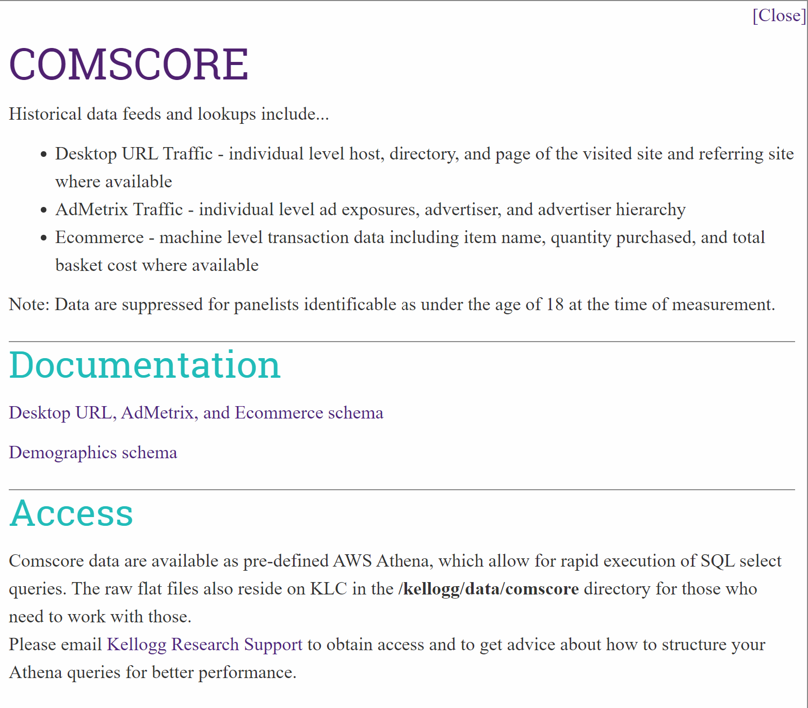
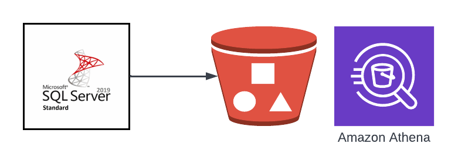

# Kellogg Datasets

Kellogg hosts several dozen [datasets](https://www.kellogg.northwestern.edu/research-support/dataset.aspx).

The KRS website has detailed information on these datasets. For example, here is the "card" for Comscore:

```{image} images/comscore-data-card.png
:border: 1px solid black
```


They can be found in several places, three of which we will describe here:

* The Kellogg Linux Cluster ([KLC](https://www.kellogg.northwestern.edu/research-support/computing/kellogg-linux-cluster.aspx))
* The Kellog Data Center ([KDC0](https://www.kellogg.northwestern.edu/research-support/computing/kellogg-data-center.aspx))
* The Kellog Data [<span style="color:purple">*Cloud*</span>](https://nu-sso.awsapps.com/start/#/)

```{note}
KDC (Kellogg Data Center) will be retired this Summer.
KDC (Kellogg Data Cloud) will take its place.

```

Accessing the Cloud version requires one extra step, authentication to AWS. Otherwise accessing the data is quite similar.
