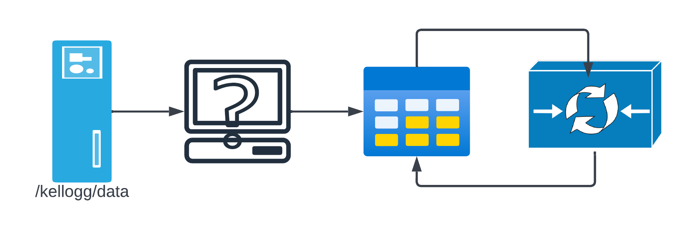

# KLC Datasets

* The Kellogg Linux Cluster ([KLC](https://www.kellogg.northwestern.edu/research-support/computing/kellogg-linux-cluster.aspx)) is a cluster of Linux servers that is available to Kellogg faculty and students.

* KLC is part of [Quest](https://www.it.northwestern.edu/departments/it-services-support/research/computing/quest/index.html) Northwestern's High-Performance Computing (HPC) cluster.




* With KLC, the data exist as inert files on disk -- there is no general way to load and query the data. Instead, we need to write code to load the data into memory, and then query it. This is a very powerful approach, but it requires some programming.
* What kinds of program you write depends on the *format* of the data files. There is no single format. Some are text-based (CSV, JSON, XML), some are binary (Parquet, Avro, ORC).

```{image} ./images/data-formats.png
    :alt: data-formats
    :width: 500px
    :align: center
```
